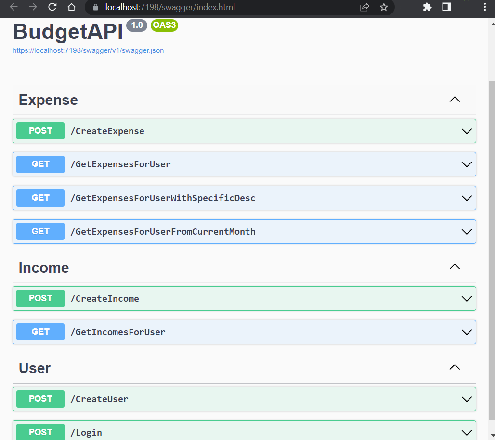

<h1>BudgetAPI</h1>

## Table of contents
* [Introduction](#introduction)
* [Features](#features)
* [Technologies](#technologies)
* [Screenshots](#screenshots)

## Introduction
Web api, which allows user to register, login, add incomes and expenses

## Features
Already done:
* Create user account
* Login
* Add expense
* Add income

Currently developing:
* Better JWT token usage
* Code refactor

Further plans:
* More options, like monthly budget, etc.

## Technologies
* ASP.NET Core WebAPI
* Entity Framework Core
* MS-SQL Database
* JWT

## Screenshots

 
 

